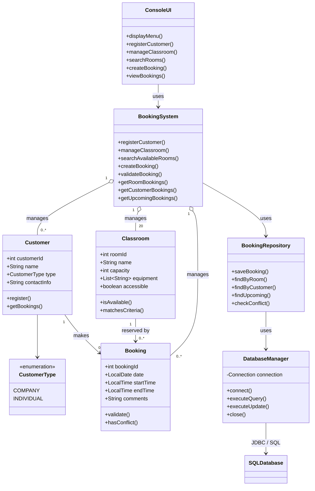

# UML Class Diagram

```mermaid
classDiagram

    class Customer {
        +int customerId
        +String name
        +CustomerType type
        +String contactInfo
        +register()
        +getBookings()
    }

    class CustomerType {
        <<enumeration>>
        COMPANY
        INDIVIDUAL
    }

    class Classroom {
        +int roomId
        +String name
        +int capacity
        +List~String~ equipment
        +boolean accessible
        +isAvailable()
        +matchesCriteria()
    }

    class Booking {
        +int bookingId
        +LocalDate date
        +LocalTime startTime
        +LocalTime endTime
        +String comments
        +validate()
        +hasConflict()
    }

    class BookingSystem {
        +registerCustomer()
        +manageClassroom()
        +searchAvailableRooms()
        +createBooking()
        +validateBooking()
        +getRoomBookings()
        +getCustomerBookings()
        +getUpcomingBookings()
    }

    class BookingRepository {
        +saveBooking()
        +findByRoom()
        +findByCustomer()
        +findUpcoming()
        +checkConflict()
    }

    class DatabaseManager {
        -Connection connection
        +connect()
        +executeQuery()
        +executeUpdate()
        +close()
    }

    class SQLDatabase {
    }

    class ConsoleUI {
        +displayMenu()
        +registerCustomer()
        +manageClassroom()
        +searchRooms()
        +createBooking()
        +viewBookings()
    }

    Customer "1" --> "0..*" Booking : makes
    Classroom "1" --> "0..*" Booking : reserved by

    BookingSystem "1" o-- "0..*" Customer : manages
    BookingSystem "1" o-- "20" Classroom : manages
    BookingSystem "1" o-- "0..*" Booking : manages

    ConsoleUI --> BookingSystem : uses
    BookingSystem --> BookingRepository : uses
    BookingRepository --> DatabaseManager : uses
    DatabaseManager --> SQLDatabase : JDBC / SQL

    Customer --> CustomerType
```